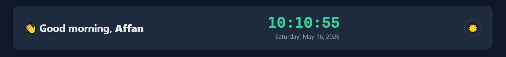
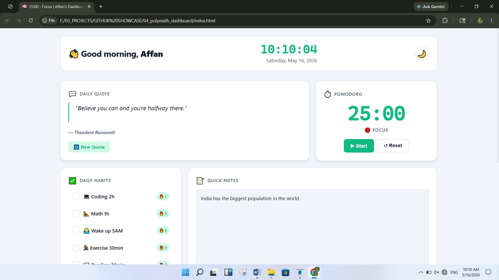
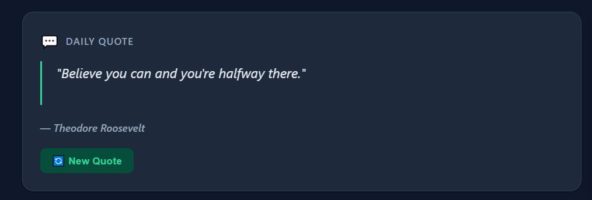
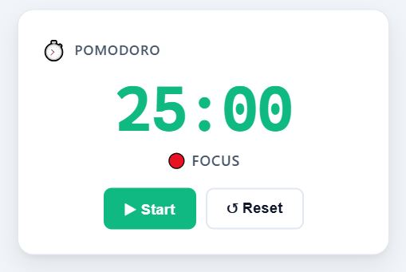
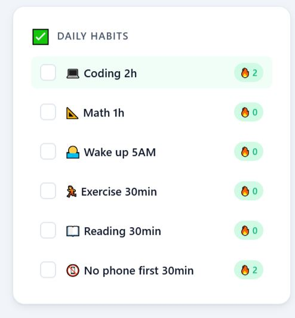
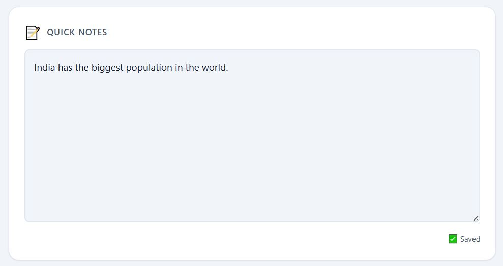
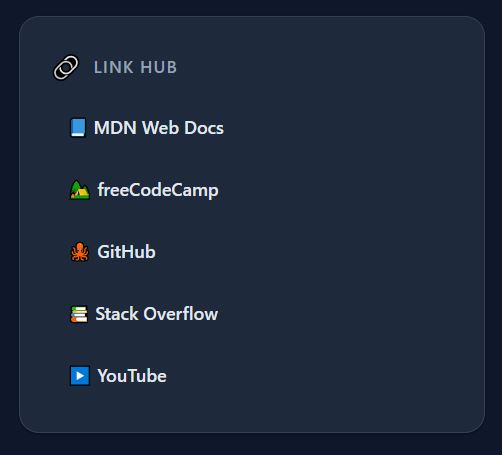

<div align="center">

# 🧠 Polymath Dashboard

### *Your Personal Productivity Command Center*

A modern, feature-rich productivity dashboard designed for focus, discipline, and continuous learning. Built with vanilla JavaScript, CSS3, and a single HTML file.

[Live Demo](#-live-demo) • [Features](#-features) • [Screenshots](#-screenshots) • [Installation](#-installation) • [Customization](#-customization)

</div>

---

## 📊 Project Status


---

## 💫 Overview

**Polymath Dashboard** is a beautifully designed, all-in-one productivity hub that brings together essential tools for daily focus and growth. Perfect for developers, students, and anyone serious about building better habits and managing their time effectively.

- ⚡ **Zero dependencies** – Pure vanilla JavaScript
- 🎨 **Beautiful UI** – Dark and light themes with smooth animations
- 💾 **Persistent storage** – All data saved locally in your browser
- 📱 **Fully responsive** – Works flawlessly on any device
- 🚀 **Fast & lightweight** – Single HTML file with embedded CSS & JS

---

## ✨ Features

| Feature | Description |
|---------|-------------|
| 🕒 **Live Clock & Date** | Real-time updates with personalized greetings (morning/afternoon/evening/night) |
| 💬 **Daily Quote** | Random inspirational quotes refreshed on demand to fuel your motivation |
| ⏱️ **Pomodoro Timer** | 25-min focus sessions with 5-min breaks; audio & visual cues included |
| ✅ **Daily Habits** | Track up to 6 habits with streak counters; auto-resets at midnight |
| 📝 **Quick Notes** | Auto-saving notes feature; never lose your thoughts or ideas |
| 🔗 **Developer Link Hub** | Curated collection of essential resources (MDN, GitHub, Stack Overflow, etc.) |
| 🌗 **Theme Toggle** | Switch between light and dark modes; preference automatically saved |
| 📱 **Responsive Design** | Seamless experience across desktop, tablet, and mobile devices |

---

## 🚀 Live Demo

### Getting Started (Local)

The easiest way to run the dashboard locally:

```bash
# Clone the repository
git clone https://github.com/your-username/polymath-dashboard.git
cd polymath-dashboard

# Option 1: Open directly (no server needed)
# Simply double-click index.html in your file explorer

# Option 2: Use a local development server
npx serve .
# or
python -m http.server 8000
# Then visit http://localhost:8000
```

### Deploy to GitHub Pages

1. Push to GitHub
2. Go to **Settings** → **Pages**
3. Set **Source** to `main` branch and `/root` folder
4. Your dashboard will be live at `https://your-username.github.io/polymath-dashboard/`

---

## 📸 Screenshots

<div align="center">

### 🏠 Home & Header


### 💡 Light Mode


### 🌙 Dark Mode


### 💬 Daily Quotes


### ⏱️ Pomodoro Timer


### ✅ Habit Tracking


### 📝 Notes Section


### 🔗 Developer Links


</div>

---

## 🛠️ Technology Stack

```
Frontend Architecture:
├── HTML5 (Semantic Markup)
├── CSS3 (Custom Properties, Flexbox, Grid, Animations)
└── JavaScript ES6 (Modular IIFE Pattern)

Data Persistence:
└── LocalStorage API

Deployment:
└── GitHub Pages (Zero Configuration)
```

**Why This Stack?**
- **No build process** – Deploy instantly
- **No dependencies** – Simpler, faster, more secure
- **Cross-browser compatible** – Works everywhere
- **Offline capable** – All data stored locally

---

## 📦 Installation

### Prerequisites
- Any modern web browser (Chrome, Firefox, Safari, Edge)
- Git (optional, for cloning)

### Step-by-Step Setup

```bash
# 1. Clone the repository
git clone https://github.com/your-username/polymath-dashboard.git
cd polymath-dashboard

# 2. Open the dashboard
# Option A: Double-click index.html
# Option B: Use a local server
python -m http.server 8000

# 3. Open in your browser
# Navigate to http://localhost:8000 (if using server)
```

**That's it!** No npm install, no build step, no configuration needed. 🎉

---

## 🧩 Usage Guide

### 📖 Quick Start

| Feature | How to Use |
|---------|-----------|
| **Quote** | Click "🔄 New Quote" button to get fresh inspiration |
| **Pomodoro** | Click "Start" to begin a 25-min focus session; auto-switches to 5-min break |
| **Habits** | Click any habit or checkbox to mark it complete; streaks track consecutive completions |
| **Notes** | Type freely; content auto-saves after 500ms or when you leave the field |
| **Theme** | Click the sun/moon icon (☀️/🌙) in the header to toggle dark/light mode |
| **Links** | Click any link in the hub to visit external resources (opens in new tab) |

### 🎯 Pro Tips

- **Pomodoro**: Use the audio cues to maintain focus; reset counter to restart a session
- **Habits**: Complete habits daily to build streaks; they auto-reset at midnight
- **Notes**: Perfect for capturing ideas, todos, or quick thoughts; everything persists
- **Theme**: Your theme preference is automatically saved and restored on next visit

---

## 📁 Folder Structure

```
polymath-dashboard/
├── index.html              # Single-file app (HTML + CSS + JS)
├── screenshots/            # Project screenshots
│   ├── header.JPG
│   ├── home_light.JPG
│   ├── home_dark.png
│   ├── quote.JPG
│   ├── pomodoro.JPG
│   ├── habbits.JPG
│   ├── notes.JPG
│   └── link.JPG
├── README.md               # This file
├── LICENSE                 # MIT License
└── .git/                   # Git repository
```

**Design Philosophy**: Single-file architecture keeps deployment simple and fast. No external dependencies, no build process, no configuration. Just open and use! ✨

---

## 🎨 Customization Guide

### Modify Daily Quotes

Edit `index.html` and locate the `QuotesModule` (around line 480):

```javascript
const quotes = [
  { text: "Your custom quote here", author: "Your Name" },
  { text: "Another inspiring quote", author: "Another Author" }
];
```

### Change Habits

Find `defaultHabits` in the `HabitsModule` (around line 550):

```javascript
const defaultHabits = [
  { id: 'habit-1', name: '🏋️ Gym 1h', completed: false, streak: 0 },
  { id: 'habit-2', name: '📚 Read 30m', completed: false, streak: 0 }
];
```

### Adjust Pomodoro Durations

Look for `WORK_DURATION` and `BREAK_DURATION` (around line 660):

```javascript
const WORK_DURATION = 25 * 60;    // 25 minutes (in seconds)
const BREAK_DURATION = 5 * 60;    // 5 minutes (in seconds)
```

### Update Link Hub

Edit the developer links section (around line 250):

```html
<ul class="links__list">
  <li><a href="https://developer.mozilla.org" target="_blank">MDN Docs</a></li>
  <li><a href="https://github.com" target="_blank">GitHub</a></li>
  <!-- Add more links here -->
</ul>
```

### Customize Colors & Theme

Modify CSS custom properties in the `:root` selector:

```css
:root {
  --bg: #f1f5f9;                /* Background color */
  --surface: #ffffff;           /* Card/Surface color */
  --text: #0f172a;              /* Text color */
  --accent: #10b981;            /* Primary accent */
  --accent-hover: #059669;      /* Hover state */
  /* ... more properties ... */
}
```

---

## 💾 Data Persistence

All user data is stored securely in your browser's `localStorage`:

| Key | Purpose | Data Type |
|-----|---------|-----------|
| `polymath_habits` | Habit state & streaks | JSON Array |
| `polymath_notes` | User notes | String |
| `polymath_theme` | Theme preference | String (light/dark) |
| `polymath_pomodoro` | Timer state | JSON Object |

**Privacy**: All data stays on your device. No tracking, no analytics, no cloud sync. ✅

---

## 🚀 Future Improvements

- [ ] **Week & Month Views** – Visualize habit trends over time
- [ ] **Custom Goals** – Set personal productivity targets
- [ ] **Export/Backup** – Download your data as JSON
- [ ] **Statistics Dashboard** – View productivity metrics and insights
- [ ] **Integration APIs** – Connect with calendar/email services
- [ ] **Mobile App Version** – React Native or Flutter version
- [ ] **Collaborative Features** – Share goals with friends or team
- [ ] **Accessibility** – Enhanced keyboard navigation and screen reader support
- [ ] **PWA Support** – Installable as app on mobile and desktop
- [ ] **Multi-language** – Internationalization support

---

## 🤝 Contributing

Contributions are welcome! Whether it's bug reports, feature requests, or code improvements, we'd love your input.

### How to Contribute

1. **Fork** the repository
2. **Create** a feature branch (`git checkout -b feature/AmazingFeature`)
3. **Commit** your changes (`git commit -m 'Add AmazingFeature'`)
4. **Push** to the branch (`git push origin feature/AmazingFeature`)
5. **Open** a Pull Request

### Guidelines

- Keep code clean and well-commented
- Test thoroughly before submitting
- Follow existing code style
- Update README if needed

---

## 📄 License

This project is licensed under the **MIT License** – see the [LICENSE](LICENSE) file for details.

You're free to use, modify, and distribute this project for personal and commercial purposes. ✅

---

## 👨‍💻 Author

**Affan** – Building tools for better productivity and continuous learning.

- 🔗 [GitHub](https://github.com/your-username)
- 🐦 [Twitter](https://twitter.com/your-handle)
- 💼 [LinkedIn](https://linkedin.com/in/your-profile)
- 🌐 [Portfolio](https://yourportfolio.com)

---

## 💡 Support

If you find this project helpful, please consider:

- ⭐ **Starring** the repository
- 🔗 **Sharing** with others
- 🐛 **Reporting** bugs or suggesting features
- 💬 **Giving feedback** in discussions

---

<div align="center">

### Made with ❤️ for productivity & personal growth

**[⬆ Back to Top](#-polymath-dashboard)**

</div>
polymath_habits_date	Last saved date (used for daily reset)
polymath_notes	Raw text from the notes area
polymath_theme	"light" or "dark"
Note: Clearing browser storage will reset all data.

☁️ Deployment to GitHub Pages
Push your code to a GitHub repository.

Go to the repository Settings → Pages (left sidebar).

Under Branch, select main (or master) and the / (root) folder.

Click Save.

After a few minutes, your dashboard will be live at:
https://your-username.github.io/polymath-dashboard/

✅ Because the dashboard is a single index.html, no extra configuration is needed.

🤝 Contributing
Contributions, issues, and feature requests are welcome!
Feel free to check the issues page.

Fork the project

Create your feature branch (git checkout -b feature/amazing)

Commit your changes (git commit -m 'Add some amazing feature')

Push to the branch (git push origin feature/amazing)

Open a Pull Request

📄 License
Distributed under the MIT License. See LICENSE file for more information (you can add a simple MIT license file if desired).

🙏 Acknowledgements
Inspired by the polymath spirit of Leonardo da Vinci and modern productivity systems.

Built with vanilla web technologies – no frameworks, just focus.

Made with ☕ and 🧠 by Affan
Keep learning, keep building.